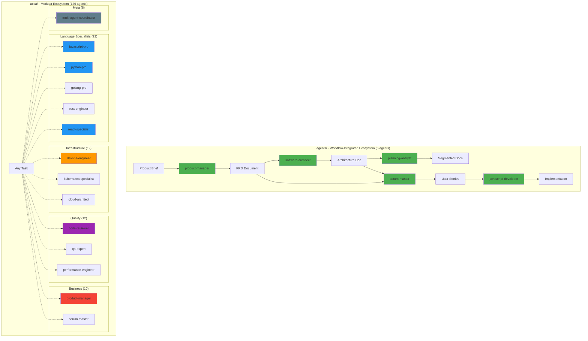
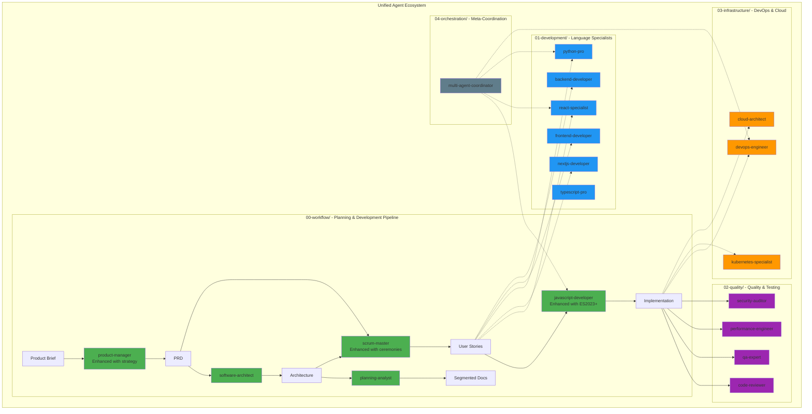
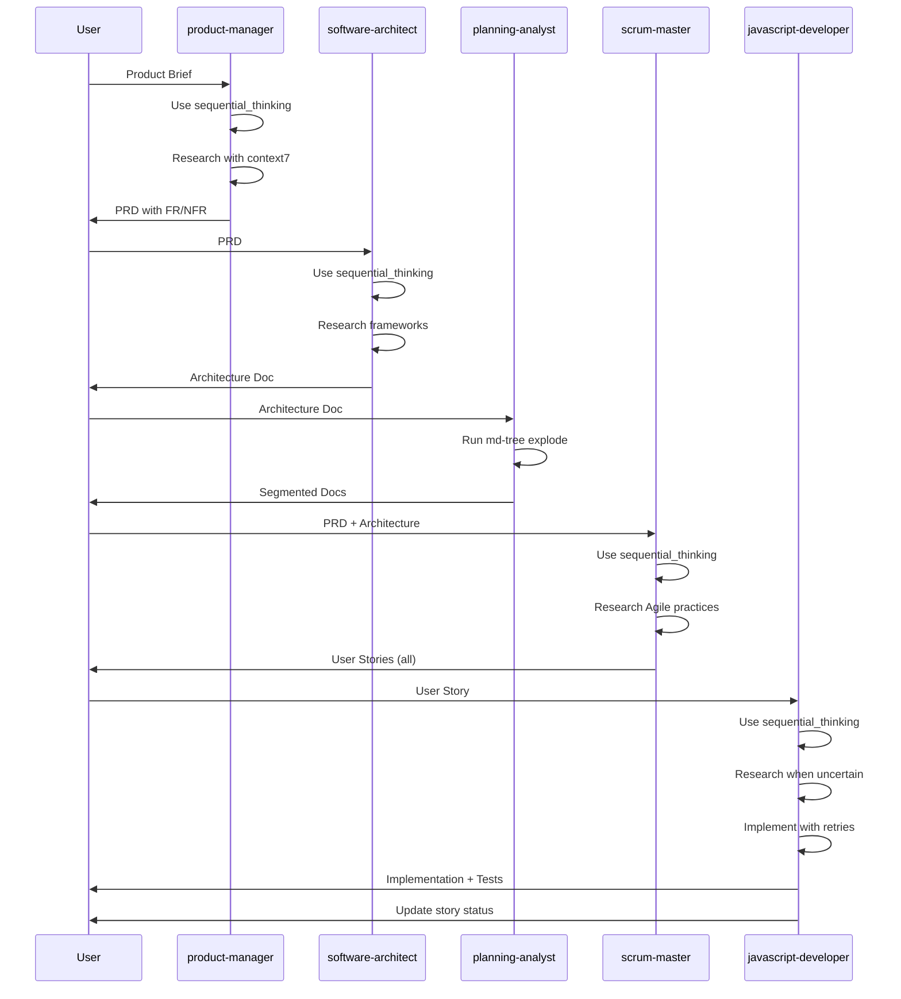
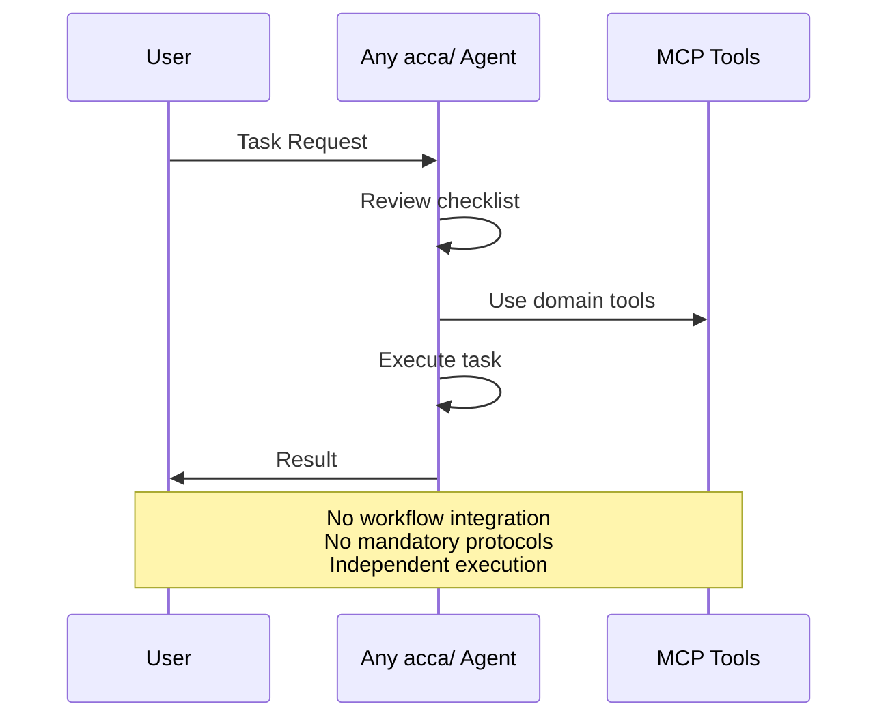
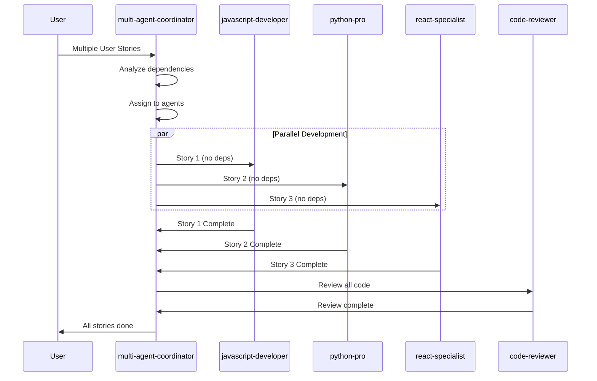
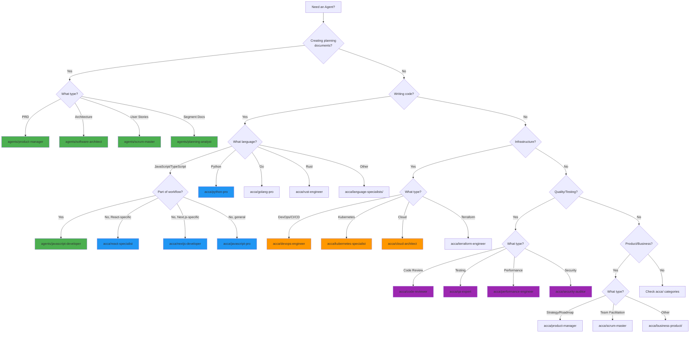

# Agent Ecosystem Visualization

This document provides visual representations of the agent ecosystems in both directories.

---

## Current State: Two Separate Ecosystems



---

## Recommended Future State: Unified Ecosystem



---

## Agent Interaction Patterns

### Pattern 1: Sequential Workflow (agents/)



### Pattern 2: Modular Task Execution (acca/)



### Pattern 3: Orchestrated Parallel Execution (Recommended)



---

## Coverage Visualization

### agents/ Coverage (5 agents)

```
Planning & Development Workflow
├── Product Management ████████████ 100%
├── Architecture Design ████████████ 100%
├── Document Organization ████████████ 100%
├── Story Creation ████████████ 100%
└── JavaScript Development ████████████ 100%

Other Languages
├── Python ░░░░░░░░░░░░ 0%
├── Go ░░░░░░░░░░░░ 0%
├── Rust ░░░░░░░░░░░░ 0%
└── Java ░░░░░░░░░░░░ 0%

Infrastructure
├── DevOps ░░░░░░░░░░░░ 0%
├── Kubernetes ░░░░░░░░░░░░ 0%
└── Cloud ░░░░░░░░░░░░ 0%

Quality & Security
├── Code Review ░░░░░░░░░░░░ 0%
├── Testing ░░░░░░░░░░░░ 0%
└── Security ░░░░░░░░░░░░ 0%
```

### acca/ Coverage (126 agents)

```
Planning & Development Workflow
├── Product Management ████████░░░░ 70% (strategy, not PRDs)
├── Architecture Design ██████░░░░░░ 50% (cloud, microservices)
├── Document Organization ░░░░░░░░░░░░ 0%
├── Story Creation ░░░░░░░░░░░░ 0%
└── JavaScript Development ████████████ 100%

Other Languages
├── Python ████████████ 100%
├── Go ████████████ 100%
├── Rust ████████████ 100%
└── Java ████████████ 100%

Infrastructure
├── DevOps ████████████ 100%
├── Kubernetes ████████████ 100%
└── Cloud ████████████ 100%

Quality & Security
├── Code Review ████████████ 100%
├── Testing ████████████ 100%
└── Security ████████████ 100%
```

### Combined Coverage (Recommended)

```
Planning & Development Workflow
├── Product Management ████████████ 100% (agents/ + acca/ strategy)
├── Architecture Design ████████████ 100% (agents/ + acca/ cloud)
├── Document Organization ████████████ 100% (agents/)
├── Story Creation ████████████ 100% (agents/)
└── JavaScript Development ████████████ 100% (agents/ + acca/)

Other Languages
├── Python ████████████ 100% (acca/)
├── Go ████████████ 100% (acca/)
├── Rust ████████████ 100% (acca/)
└── Java ████████████ 100% (acca/)

Infrastructure
├── DevOps ████████████ 100% (acca/)
├── Kubernetes ████████████ 100% (acca/)
└── Cloud ████████████ 100% (acca/)

Quality & Security
├── Code Review ████████████ 100% (acca/)
├── Testing ████████████ 100% (acca/)
└── Security ████████████ 100% (acca/)
```

---

## Decision Tree: Which Agent to Use?



---

## Color Legend

- 🟢 **Green** - agents/ workflow-integrated agents
- 🔵 **Blue** - acca/ development specialists
- 🟠 **Orange** - acca/ infrastructure specialists
- 🟣 **Purple** - acca/ quality & security specialists
- ⚫ **Gray** - acca/ meta-orchestration

---

**See Also**:
- [Full Analysis](./AGENT_COMPARISON_ANALYSIS.md)
- [Quick Summary](./AGENT_COMPARISON_SUMMARY.md)
- [Comparison Matrix](./AGENT_COMPARISON_MATRIX.md)
