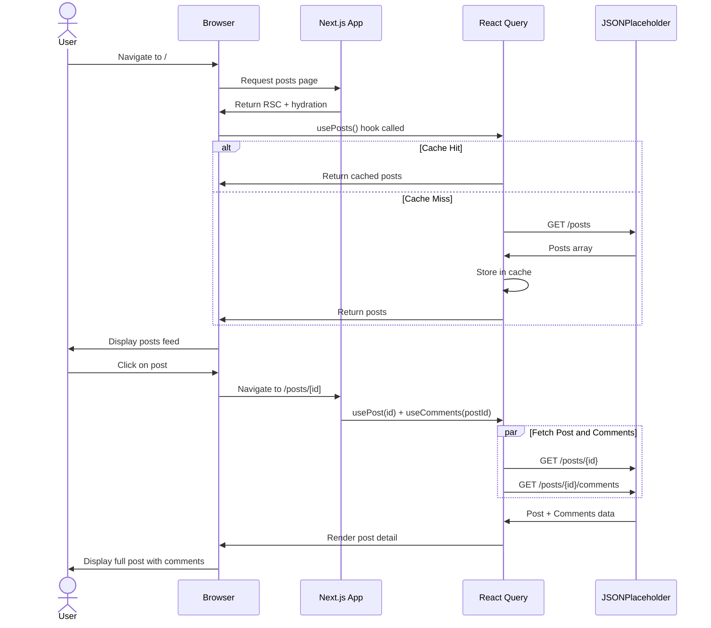
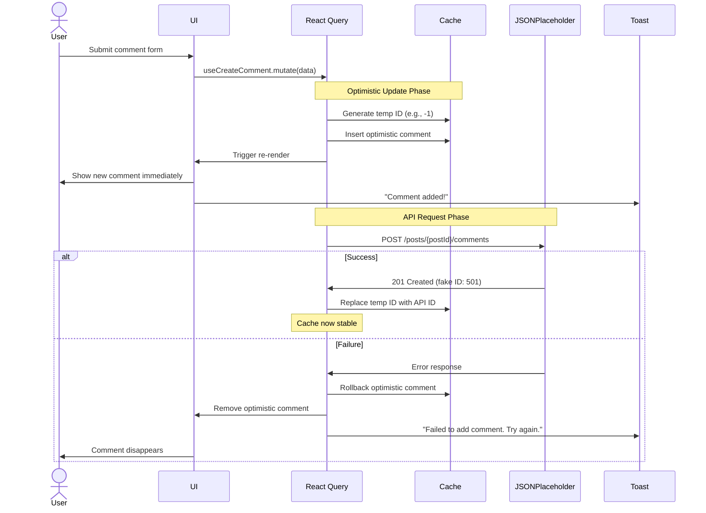
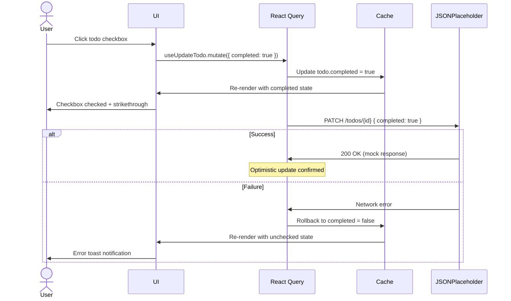

# Core Workflows

## Post Viewing Workflow

```mermaid
sequenceDiagram
    actor User
    participant Browser
    participant NextJS as Next.js App
    participant RQ as React Query
    participant API as JSONPlaceholder

    User->>Browser: Navigate to /
    Browser->>NextJS: Request posts page
    NextJS->>Browser: Return RSC + hydration
    Browser->>RQ: usePosts() hook called

    alt Cache Hit
        RQ->>Browser: Return cached posts
    else Cache Miss
        RQ->>API: GET /posts
        API->>RQ: Posts array
        RQ->>RQ: Store in cache
        RQ->>Browser: Return posts
    end

    Browser->>User: Display posts feed

    User->>Browser: Click on post
    Browser->>NextJS: Navigate to /posts/[id]
    NextJS->>RQ: usePost(id) + useComments(postId)

    par Fetch Post and Comments
        RQ->>API: GET /posts/{id}
        RQ->>API: GET /posts/{id}/comments
    end

    API->>RQ: Post + Comments data
    RQ->>Browser: Render post detail
    Browser->>User: Display full post with comments
```

## Optimistic Comment Creation Workflow

```mermaid
sequenceDiagram
    actor User
    participant UI
    participant RQ as React Query
    participant Cache
    participant API as JSONPlaceholder
    participant Toast

    User->>UI: Submit comment form
    UI->>RQ: useCreateComment.mutate(data)

    Note over RQ,Cache: Optimistic Update Phase
    RQ->>Cache: Generate temp ID (e.g., -1)
    RQ->>Cache: Insert optimistic comment
    RQ->>UI: Trigger re-render
    UI->>User: Show new comment immediately
    UI->>Toast: "Comment added!"

    Note over RQ,API: API Request Phase
    RQ->>API: POST /posts/{postId}/comments

    alt Success
        API->>RQ: 201 Created (fake ID: 501)
        RQ->>Cache: Replace temp ID with API ID
        Note over RQ: Cache now stable
    else Failure
        API->>RQ: Error response
        RQ->>Cache: Rollback optimistic comment
        RQ->>UI: Remove optimistic comment
        RQ->>Toast: "Failed to add comment. Try again."
        UI->>User: Comment disappears
    end
```

## Todo Toggle Workflow

```mermaid
sequenceDiagram
    actor User
    participant UI
    participant RQ as React Query
    participant Cache
    participant API as JSONPlaceholder

    User->>UI: Click todo checkbox
    UI->>RQ: useUpdateTodo.mutate({ completed: true })

    RQ->>Cache: Update todo.completed = true
    Cache->>UI: Re-render with completed state
    UI->>User: Checkbox checked + strikethrough

    RQ->>API: PATCH /todos/{id} { completed: true }

    alt Success
        API->>RQ: 200 OK (mock response)
        Note over RQ: Optimistic update confirmed
    else Failure
        API->>RQ: Network error
        RQ->>Cache: Rollback to completed = false
        Cache->>UI: Re-render with unchecked state
        UI->>User: Error toast notification
    end
```

---
