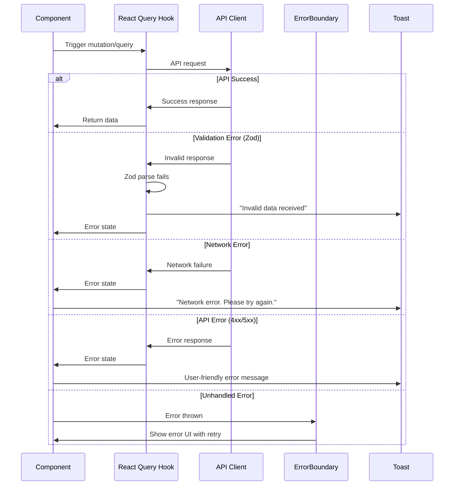

# Error Handling Strategy

## Error Flow



## Error Response Format

```typescript
interface ApiError {
  error: {
    code: string;
    message: string;
    details?: Record<string, any>;
    timestamp: string;
    requestId: string;
  };
}
```

**Note:** JSONPlaceholder doesn't return structured errors, so our API client wraps native errors into this format.

## Frontend Error Handling

```typescript
// lib/hooks/use-create-comment.ts
import { useMutation, useQueryClient } from '@tanstack/react-query';
import { toast } from 'sonner';
import { createComment } from '@/lib/api/comments';
import { queryKeys } from '@/lib/query-keys';
import type { Comment, CommentFormData } from '@/types';

export function useCreateComment(postId: number) {
  const queryClient = useQueryClient();

  return useMutation({
    mutationFn: (data: CommentFormData) => createComment(postId, data),

    // Optimistic update
    onMutate: async (newComment) => {
      // Cancel outgoing refetches
      await queryClient.cancelQueries({
        queryKey: queryKeys.comments.list(postId)
      });

      // Snapshot previous value
      const previousComments = queryClient.getQueryData<Comment[]>(
        queryKeys.comments.list(postId)
      );

      // Optimistically update cache
      queryClient.setQueryData<Comment[]>(
        queryKeys.comments.list(postId),
        (old = []) => [
          ...old,
          {
            id: -Date.now(), // Temporary negative ID
            postId,
            ...newComment,
          },
        ]
      );

      return { previousComments };
    },

    // Success handler
    onSuccess: (newComment) => {
      toast.success('Comment added!');

      // Replace optimistic comment with real one
      queryClient.setQueryData<Comment[]>(
        queryKeys.comments.list(postId),
        (old = []) => old.map(comment =>
          comment.id < 0 ? newComment : comment
        )
      );
    },

    // Error handler with rollback
    onError: (error, _variables, context) => {
      // Rollback to previous state
      if (context?.previousComments) {
        queryClient.setQueryData(
          queryKeys.comments.list(postId),
          context.previousComments
        );
      }

      // Show user-friendly error
      if (error instanceof APIError) {
        toast.error(`Failed to add comment: ${error.message}`);
      } else {
        toast.error('Failed to add comment. Please try again.');
      }
    },

    // Always refetch after mutation settles
    onSettled: () => {
      queryClient.invalidateQueries({
        queryKey: queryKeys.comments.list(postId)
      });
    },
  });
}
```

## Error Boundary Pattern

```typescript
// app/error.tsx (Next.js error boundary)
'use client';

import { useEffect } from 'react';
import { Button } from '@/components/ui/button';

export default function Error({
  error,
  reset,
}: {
  error: Error & { digest?: string };
  reset: () => void;
}) {
  useEffect(() => {
    // Log error to console (could send to error tracking service)
    console.error('Application error:', error);
  }, [error]);

  return (
    <div className="flex min-h-screen flex-col items-center justify-center p-4">
      <div className="text-center">
        <h1 className="text-4xl font-bold mb-4">Something went wrong!</h1>
        <p className="text-muted-foreground mb-8">
          {error.message || 'An unexpected error occurred.'}
        </p>
        <div className="flex gap-4 justify-center">
          <Button onClick={reset}>
            Try again
          </Button>
          <Button variant="outline" onClick={() => window.location.href = '/'}>
            Go home
          </Button>
        </div>
      </div>
    </div>
  );
}
```

---
