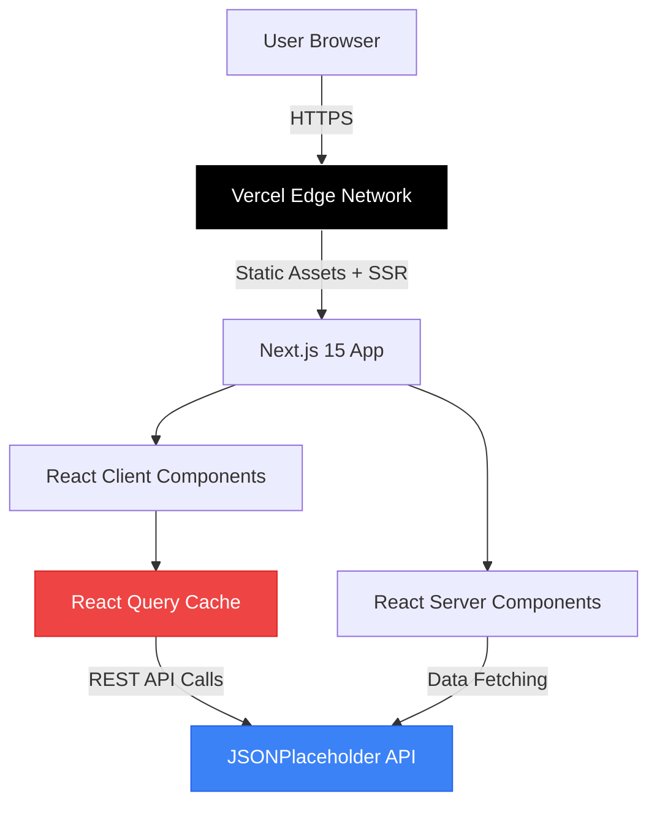

# High Level Architecture

## Technical Summary

The Mini Social Feed is built as a modern Jamstack application using Next.js 15 with App Router, deployed on Vercel's edge network. The architecture leverages React Server Components for optimal performance while maintaining rich client-side interactivity through React Query for state management and optimistic UI patterns. The application consumes the JSONPlaceholder REST API as its exclusive data source, implementing mock CRUD operations with sophisticated cache invalidation strategies. TypeScript strict mode ensures type safety across the entire codebase, while shadcn/ui components built on Radix primitives provide accessible, production-ready UI elements. This serverless architecture eliminates backend infrastructure concerns while delivering a realistic social platform experience through client-side state orchestration.

## Platform and Infrastructure Choice

**Platform:** Vercel

**Key Services:**
- **Hosting:** Vercel Edge Network (global CDN)
- **Build System:** Vercel Build Infrastructure (automatic CI/CD)
- **Analytics:** Vercel Analytics (Web Vitals monitoring)
- **Preview Deployments:** Automatic PR previews

**Deployment Host and Regions:** Global edge deployment via Vercel's CDN (automatic geo-distribution)

**Rationale:** Vercel provides the optimal platform for Next.js applications with zero-configuration deployment, automatic HTTPS, edge caching, and seamless integration with Next.js 15 features. Since this application has no backend infrastructure requirements (JSONPlaceholder API only), Vercel's serverless architecture perfectly matches the PRD's "no backend database" constraint while providing production-grade hosting.

## Repository Structure

**Structure:** Monorepo (single package)

**Monorepo Tool:** Not applicable (simple Next.js project structure)

**Package Organization:** Single-package Next.js application with clear separation of concerns through folder structure. The PRD specifies a self-contained application with no separate services, making a complex monorepo tool unnecessary. All code resides in a standard Next.js 15 App Router project with organized folders for components, hooks, utilities, and types.

**Rationale:** The project's scope (frontend-only social feed with external API) doesn't warrant multi-package complexity. A clean Next.js project structure provides sufficient organization while maintaining simplicity for AI agent development and human developers.

## High Level Architecture Diagram

## Architectural Patterns

- **Jamstack Architecture:** Static site generation with client-side data fetching - _Rationale:_ Optimal performance through CDN-served static pages while maintaining dynamic content via JSONPlaceholder API calls
- **Component-Based UI:** Reusable React components with TypeScript - _Rationale:_ Maintainability and type safety across large component libraries; shadcn/ui provides accessible primitives
- **Optimistic UI Pattern:** Immediate UI updates before server confirmation - _Rationale:_ Critical for mock CRUD operations; provides realistic feel despite JSONPlaceholder's ephemeral responses
- **Server Component First:** Prefer RSC for data fetching, client components for interactivity - _Rationale:_ Reduces JavaScript bundle size and improves initial page load performance
- **Atomic Design System:** Components organized by complexity (atoms → organisms) - _Rationale:_ Scales well with shadcn/ui's component library structure
- **Cache-First Strategy:** React Query manages client-side cache with stale-while-revalidate - _Rationale:_ Reduces API calls and provides instant navigation between pages

---
